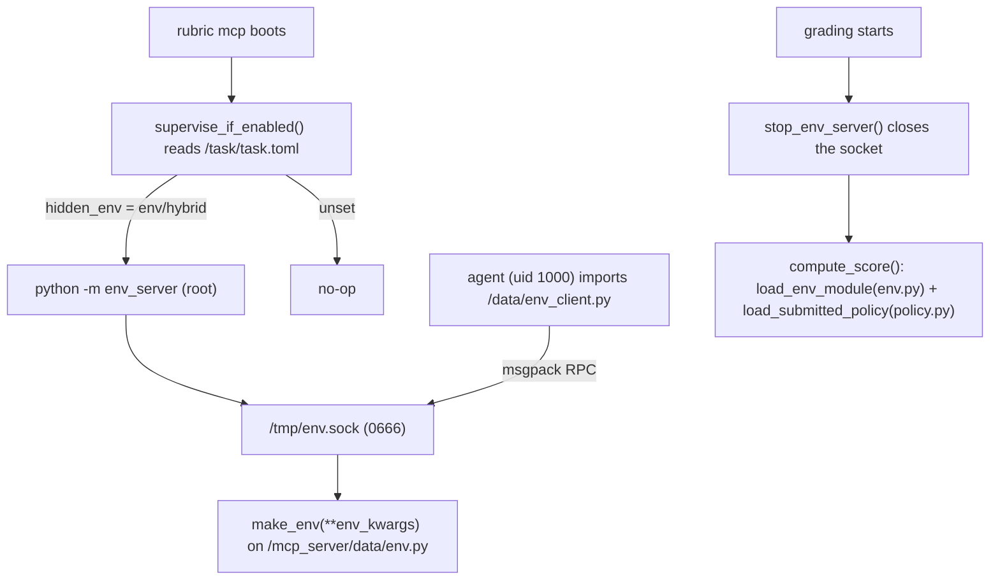

# Hidden-environment tasks (the env server)

Some tasks need the agent to **interact with a black-box environment** whose
dynamics it must infer over an episode -- a simulator, a market, a bandit, a
game opponent, an adaptive system -- without ever reading the environment's
source, reward function, or hidden parameters. The template supports this with
an opt-in per-task **RPC env server** (`env_server`).

## When to use this (and when NOT to)

Use `hidden_env` when ALL of these hold:

- The task is **simulation / interaction based**: the agent must *probe* the
  environment (call `reset` / `step` / custom methods, observe responses) to
  succeed, not just transform a static input.
- The environment's **dynamics or reward must stay hidden** -- if the agent
  could read them it could shortcut the task (e.g. read the optimal policy, the
  held-out targets, or the scoring function).
- Interaction happens **during the rollout** (the agent explores live), and the
  decision is then frozen and graded.

Do NOT use it for:

- **Static-data tasks** (ML on a fixed dataset, CFD/structures on a fixed case,
  a one-shot artifact the grader checks) -- ship the data under `data/` and grade
  the submitted artifact. The env server is pure overhead there.
- Tasks where the "environment" is just a public helper the agent may read --
  put it in `data/` and skip the server.

`hidden_env` is **orthogonal to `task_type`**: an `ml`, `mujoco`, `cfd`, or
`structures` task can each opt in. It is a runtime capability, not a domain.

## How it works



- The env source lives at `scorer/data/env.py` -> baked **root-only** to
  `/mcp_server/data/env.py`. The agent (uid 1000) cannot read it.
- At container boot the rubric MCP server calls `supervise_if_enabled()`, which
  reads `[environment].hidden_env` from the baked `/task/task.toml`. If `env` or
  `hybrid`, it spawns `python -m env_server` (and restarts it on crash).
- The agent connects to `/tmp/env.sock` using `data/env_client.py` (baked to
  `/data/env_client.py`) and calls methods on the env instance.
- Before grading, `stop_env_server()` tears the socket down, so the agent has no
  grade-time access to the live env (no free `reset()`-seed fingerprinting, no
  twin-env oracle, no private-method probing). The grader instead loads the
  held-out env **in-process** via `grading.load_env_module` and runs the agent's
  submitted policy via `grading.load_submitted_policy`.

## Author contract

1. **Enable it** in `task.toml`:

```toml
[environment]
hidden_env = "env"      # or "hybrid" to also ship static data/ files
```

2. **Write the env** at `scorer/data/env.py` with a `make_env` factory:

```python
def make_env(**env_kwargs):
    return MyEnv(**env_kwargs)
```

The returned instance exposes any methods you like (`reset` / `step` / `close`
work out of the box; so do custom methods like `quote(symbol)` or `pull(arm)`).

3. **Hide the answer.** Methods the grader needs but the agent must not call
   (an oracle, the held-out target, a budget) should be excluded from the socket
   surface. Either prefix them with `_`, or declare an allow-list:

```python
class MyEnv:
    _env_public_methods = frozenset({"reset", "step", "n_arms"})
    def best_arm(self): ...   # grader-only; NOT reachable over the socket
```

A malformed `_env_public_methods` fails **closed** (rejects everything).

4. **Ship the client.** Copy the canonical
   [`grader/src/env_server/env_client.py`](../grader/src/env_server/env_client.py)
   to `data/env_client.py` and add a thin task-specific subclass. It is baked to
   `/data/env_client.py` (agent-readable).

5. **Grade in-process.** In `scorer/compute_score.py`:

```python
from grading import AgentFault, load_env_module, load_submitted_policy

def compute_score(workspace, trajectory, private):
    env = load_env_module(private / "env.py").make_env(seed=0)   # held-out
    policy = load_submitted_policy(workspace / "policy.py")      # sandboxed
    try:
        action = policy.choose()
    except AgentFault:
        raise
    except Exception as exc:  # submitted-policy boundary
        raise AgentFault(f"policy failed: {exc}") from exc
    finally:
        policy.close()
    return score_from(env, action)
```

`load_submitted_policy` runs the agent's `policy.py` in the same privilege-dropped
sandbox as `PolicyWorker`, supports a named factory (`load_policy` by default), a
source mode (a grader wrapper for an agent data artifact), and multi-policy
factories (a dict / list of proxies). It raises `AgentFault` for a missing /
non-regular / oversized policy or a load-time crash.

### Optional `env_config.json`

Place `scorer/data/env_config.json` to override defaults:

```json
{ "module": "envs/__init__.py", "factory": "build_env",
  "allowed_env_kwargs": ["seed", "split"] }
```

`allowed_env_kwargs` pins the `env_kwargs` the agent may pass to `make_env` on
`__create__`. Regardless, the server always rejects any kwarg string that
resolves under `/mcp_server` (so a rollout cannot redirect a privileged read).

## Reward-hacking closures (built in)

- **No source access**: env baked root-only (0700) at `/mcp_server/data`.
- **No private methods over the wire**: `_`-prefixed names and anything outside
  `_env_public_methods` are rejected.
- **No path redirection**: `env_kwargs` resolving under `/mcp_server` are rejected;
  optional `allowed_env_kwargs` pins the create contract.
- **No grade-time env access**: `stop_env_server()` closes the socket before the
  grader runs; the grader uses the in-process held-out env.
- **No stdout score forging**: the policy worker returns values over a dedicated
  pipe, never stdout.
- **No traceback leakage**: server error replies to the agent never include the
  server-side traceback (it is logged root-side only).

See [REWARD_HACKING.md](REWARD_HACKING.md) for the full catalog.

## Reference

A complete, runnable task lives at
[`examples/hidden-env-bandit/`](../examples/hidden-env-bandit/): a hidden bandit
the agent explores over the socket, graded by regret against the held-out env.
